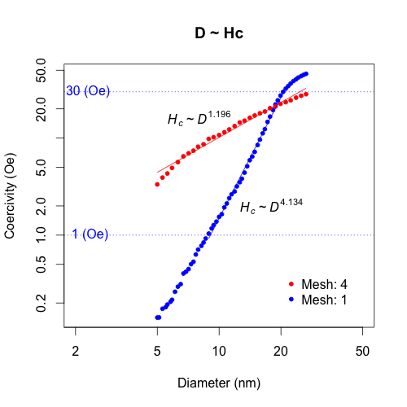

<script type="text/javascript" src="http://cdn.mathjax.org/mathjax/latest/MathJax.js?config=TeX-AMS-MML_HTMLorMML"></script>

# Mesh 1 → 4 

- NSIZE:64
- Diameter: 5 ~ 26.5(nm)
	- eg. 10nm: 2.5nm x 4cells




$$\sin{x}$$

Mesh が2以上の場合計算できなかった原因修正


```fortran
184   do k = 1, zsize
185     do j = 1, ysize
186       do i = 1, xsize
187         m_size(i,j,k) = m_size_GRAIN(i/GRAIN_MESH,j/GRAIN_MESH,k/GRAIN_MESH)
188         Ku(:,i,j,k) = Ku_GRAIN(:,i/GRAIN_MESH,j/GRAIN_MESH,k/GRAIN_MESH)
189         ea(:,i,j,k) = ea_GRAIN(:,i/GRAIN_MESH,j/GRAIN_MESH,k/GRAIN_MESH)
190         m(:,i,j,k)  = m_GRAIN(:,i/GRAIN_MESH,j/GRAIN_MESH,k/GRAIN_MESH)
191       end do
192     end do
193   end do
194 

187         m_size(i,j,k) = m_size_GRAIN(i/GRAIN_MESH +1,j/GRAIN_MESH +1,k/GRAIN_MESH +1)
188         Ku(:,i,j,k) = Ku_GRAIN(:,i/GRAIN_MESH +1,j/GRAIN_MESH +1,k/GRAIN_MESH +1)
189         ea(:,i,j,k) = ea_GRAIN(:,i/GRAIN_MESH +1,j/GRAIN_MESH +1,k/GRAIN_MESH +1)
190         m(:,i,j,k)  = m_GRAIN(:,i/GRAIN_MESH +1,j/GRAIN_MESH +1,k/GRAIN_MESH +1)
```
